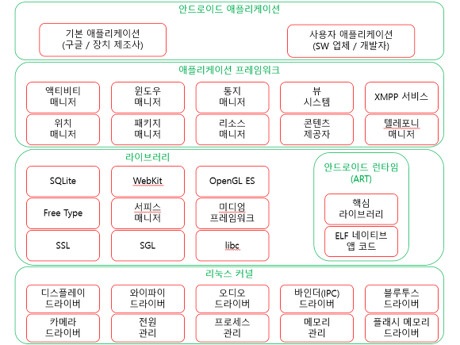

# 1. 안드로이드 아키텍쳐

안드로이드 애플리케이션을 개발하기 위해서는 안드로이드의 전체적인 아키텍처를 알 필요가 있다.  
그래서 이 장에서는 안드로이드 아키텍쳐에 대해 알아볼 것이다.

## 1-1. 안드로이드 소프트웨어 스택

안드로이드 시스템은 소프트웨어 스택(Stack)의 형태로 구성된다.  
애플리케이션, 운영체제, 런타임 환경, 미들웨어, 각종 서비스와 라이브러리등이 겹겹이 모여 구성된 것이라고 생각할 수 있다. 시각적으로 표현하면 아래 그림과 같다.  

이제 스택의 각층에 대해 맨 밑층 부터 알아볼 것이다.

## 1-2. 리눅스 커널

소프트웨어 스택의 맨 밑에 위치한다. 리눅스 커널은 장치 하드웨어의 기반 운영체제 역할을 담당한다. 멑티태스킹을 지원하고 메모리 관리와 프로세스 실행 및 관리 등을 처리하는 핵심 시스템 서비스를 비롯해서 네트워크 인터페이스와 각종 하드웨어 인터페이스를 위한 장치 드라이버를 제공한다. 

안드로이드는 리눅스의 커널만 사용한다. 원래 리눅스는 데스크톱이나 서버의 컴퓨터에서 사용하기 위해 개발되었다. 실제로 지금은 리눅스가 엔터프라이즈 서버 환경에서 널리 사용된다. 또 리눅스 커널의 효율성과 성능이 좋으므로 안드로이드 소프트웨어 스택의 핵심으로 모바일 장치에서도 사용된다.

## 1-3. 안드로이드 런타임 - ART

안드로이드 스튜디오에서 애플리케이션이 빌드될 때는 바이트 코드 형태(DEX, Dalvik Executable)로 컴파일된다. 장치에 애플리케이션이 설치될 때 안드로이드 런타임(ART, Android RunTime)이 AOT(Ahead-Of-Time) 컴파일을 수행하여 바이트 코드를 장치의 프로세서(CPU)가 필요로 하는 네이티브 명령어(기계어)로 일괄 변환한다. 이렇게 변환된 형태를 ELF(Excutable and Linkable Format)라고 한다. 따라서 애플리케이션이 런칭될 때마다 ELF 버전으로 실행되므로 애플리케이션의 실행 속도가 더 빠르고 배터리 수명도 향상된다.

5.x(롤리팝) 버전에서는 애플리케이션이 런칭될 때마다 JIT(Just-in-Time) 컴파일 방법을 사용하여 달빅 가상머신(VM, Virtual Machine)에서 바이트 코드를 하나씩 기계어로 변환하면서 실행하였다.

## 1-4. 안드로이드 라이브러리

문자열 처리, 네트워킹, 파일 처리와 같은 일반적인 작업을 지원하기 위해 제공되는 표준 라이브러리에 추가하여 안드로이드 개발 환경에는 안드로이드 라이브러리도 포함된다. 이는 안드로이드 애플리케이션 개발에 특화된 다양한 자바 기반 라이브러리다. 이 부류의 라이브러리 예로는 애플리케이션 프레임워크 라이브러리를 포함하여 사용자 인터페이스 생성, 그래픽 드로잉, 데이터베이스 엑세스 등을 가능하게 해주는 라이브러리가 있다.

사용 가능한 핵심 안드로이드 라이브러리를 요약하면 다음과 같다.

- **android.app** - 애플리케이션 모델의 액세를 제공하며, 모든 안드로이드 애플리케이션의 초석이 되는 라이브러리다.

- **android.content** - 애플리케이션과 애프리케이션 컴포넌트 간의 콘텐트 액세스와 메시징을 가능하게 한다.

- **android.database** - 콘텐트 제공자가 게시한 데이터를 액세스하는 데 사용되고, SQLite 데이터베이스 관리 클래스를 포함한다.

- **android.graphics** - 생삭, 포인트, 필터 사각형, 캔버스를 포함하는 낮은 수준의 2D 그래픽 드로잉 API다.

- **android.hardware** - 가속도 센서와 광 센서 같은 하드웨어의 액세스를 제공하는 API를 나타낸다.

- **android.openhl** - OpenGL ES 3D 그래픽 렌더링 API의 자바 인터페이스다.

- **android.os** - 메세지, 시스템 서비스, 프로세스 간 통신을 포함하는 표준 운영체제 서비스의 액세를 애플리케이션에 제공한다.

- **android.media** - 오디오와 비디오의 재생을 할 수 있는 클래스 제공한다.

- **android.net** - 네트워크 액세스를 제공하는 API. 장치의 문서 네트워크 액세스를 제공하는 android.net.wifi를 포함한다.

- **android.print** - 안드로이드 애플리케이션에서 프린터로 콘텐트를 전송할 수 있는 클래스들을 포함한다.

- **android.provider** - 캘린더나 연락처 애플리케이션에서 유지하는 것과 같은 표준 안드로이드 콘텐트 제공자 데이터베이스의 액세를 제공하는 클래스들이 있다.

- **android.text** - 장치 화면에 텍스트를 나타내고 처리하는 데 사용한다.

- **android.util** - 문자열과 숫자 변환, XML 처리, 날짜와 시간 처리 등의 일을 수행하는 유틸리티 클래스들이 있다.

- **android.view** - 애플리케이션의 사용자 인터페이스를 구성하는 뷰 클래스들이 있다.

- **android.widget** - 버튼, 라벨, 리스트 뷰, 레이아웃 매니저, 라디오 버튼과 같은 같은 사전 제각된 사용자 인터페이스 컴포넌트들이 있다.

- **android.webkit** - 웹 브라우징 능력을 애플리케이션에 구성할 수 있게 해주는 클래스들이 있다.

안드로이드 런타임의 자바 기반 코어 라이브러리를 알아 보았다. 이제 C/C++ 기반의 라이브러리에 대해 알아보자.

## 1-5. C/C++ 라이브러리

위에서 알아본 안드로이드 런타임 코어 라이브러리는 자바 기반이고, 개발자가 안드로이드 애플리케이션을 작성하는 데 필요한 주요 API를 제공한다. 그러나 코어 라이브러리는 대부분의 실제 작업을 직접 수행하지 않는다.  
코어 라이브러리는 C/C++ 기반 라이브러리의 코드를 감싸고 있는 자바 래퍼(wrapper)다.  
그 예로 장치 화면에 3D 그래픽을 그리기 위해 android.opengl 라이브러리의 코드를 호출하면 그 코드에서는 OpenGL ES C++ 라이브러리의 코드를 호출한다. 결국, 이 코드는 내부의 리눅스 커널과 함께 동작하게 된다.

C/C++ 라이브러리에는 폭넓고 다양한 함수들이 포함되어 있다. 예를들어, 2D와 3D 그래픽, SSL(Secure Sockets Layer) 통신, SQLite 데이터베이스 관리 시스템, 오디와 비디오 재생, 비트맵과 벡터 폰트 렌더링, 표준 C 시스템 라이브러리(libc) 등이다.

보통의 안드로이드 애플리케이션 개발자는 자바 기반 안드로이드 코어 라이브러리 API를 통해서만 C/C++ 라이브러리를 액세스할 것이다. 그러나 이 라이브러리를 직접 액세스한 필요가 있을 경우에는 안드로이드 NDK(Native Develoment Kit)를 사용하면 된다. 자바 코드에서 JNI(Java Native Interface)를 사용해서 자바 외의 다른 프로그래밍 언어(C나 C++ 등)의 네이티브 메서드를 호출하기 위한 것이 NDK의 목적이다.

## 1-6. 애플리케이션 프레임워크

안드로이드 애플리케이션이 실행되고 관리되는 환경을 형성하는 서비스의 집합체가 애플리케이션 프레임워크다. 안드로이드 애플리케이션들이 재사용과 상호 운용 및 교체 가능한 컴포넌트로 구성된다는 개념을 이 프레임워크가 구현한다.

안드로이드 프레임워크는 다음의 핵심 서비스를 포함한다.

- **액티비티 매니저(Activity Manager)** - 애플리케이션의 생명주기(lifecycle)과 액티비티 스택을 제어한다.

- **콘텐트 제공자(Content Provider)** - 애플리케이션이 다른 애플리케이션과 데이터를 게시 및 공유할 수 있게 해준다.

- **리소스 매니저(Resource Manager)** - 코드에 포함되지 않는 리소스(문자열, 색상 설정, 사용자 인터페이스 레이아웃 등)의 액세스를 제공한다.

- **알림 매니저(Nofications Manager)** - 애플리케이션이 사용자에게 경고나 알림을 보여줄 수 있게 해준다.

- **뷰 시스템(View System)** - 애플리케이션의 사용자 인터페이스 새엇에 사용되는 확장 가능한 뷰들의 집합이다.

- **패키지 매니저(Package Manager)** - 애플리케이션에서 장치에 설치된 다른 애플리케이션에 관한 정보를 알 수 있는 시스템이다.

- **텔레포니 매니저(Telephony Manager)** - 장치에서 사용 가능한 전화 서비스에 관한 정보(상태나 가입자 등)를 애플리케이션에 제공한다.

- **위치 매니저(Location Manager)** - 앱이 위치 변경 정보를 수신할 수 있게 해주는 위치 서비스의 액세스를 제공한다.

## 1-7. 애플리케이션

안드로이드 소프트웨어 스택의 맨 위에 있는 것이 애플리케이션이다. 특별한 안드로이드 애플리케이션으로 제공되는 기본 애플리케이션(웹 브라우저와 이메일 애플리케이션 등)과 장치 구입 후 사용자가 설치한 애플리케이션으로 구성되는 것이 애플리케이션 계층이다.

## 1-8. 정리

- 안드로이드는 소프트웨어 스택 아키텍처의 형태로 구현되어 있다.

- 리눅스 커널, 런타임 환경과 그에 부합되는 라이브러리, 애플리케이션 프래임워크, 애플리케이션등이 스택을 구성한다.

- 애플리케이션은 자바로 작성되고 안드로이드 스튜디오 빌드 환경에서 바이트 코드 형태로 컴파일 된다.

- 애플리케이션이 장치에 설치될 때 안드로이드 런타임(ART)이 바이트 코드를 장치의 프로세서(CPU)가 필요로 하는 네이티브 명령어(기계어)로 일괄 변환한다.

- 애플리케이션 실행과 애플리케이션 디자인의 재사용 구현 관점 모두에서 안드로이드 아키텍쳐의 목표는 성능과 효율이다.
