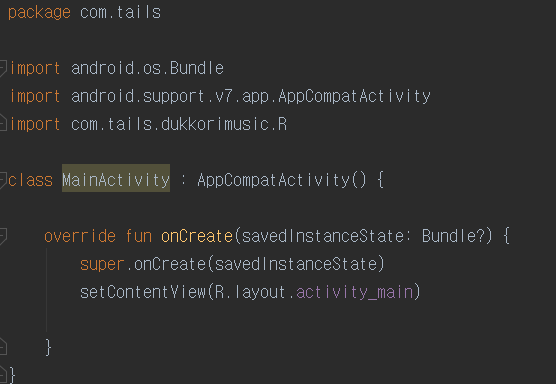
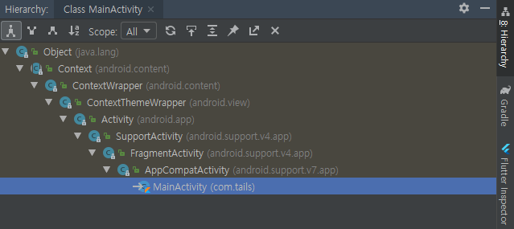
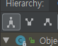
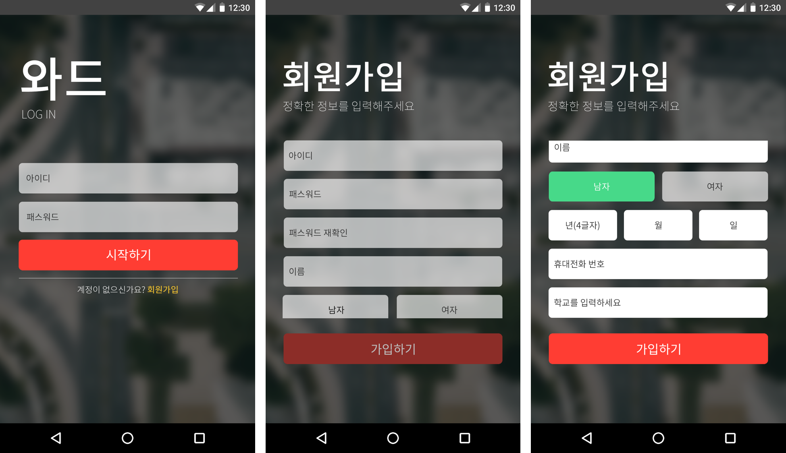

# 5. 액티비티 상태 변화 처리하기

[안드로이드 애플리케이션과 액티비티 생명주기](https://github.com/SeungYongSon/Gaining-Ground-To-Android/tree/master/3.%20Android%20Application%20%26%20Activity%20Lifecycle) 에서 알 수 있듯  
애플리케이션이 존속하는 동안 애플리케이션을 구성하는 액티비티가 여러 다른 상태를 거친다는 점을 알았을 것이다.  
그리고 한 상태에서 다른 상태로의 변화는 안드로이드 런타임 시스템에 의해 수행되므로 액티비티 자신이 제어할 수 없다.  
몰론 대부분의 경우에 액티비티가 상황에 맞춰 반응할 시간적 여유를 주기 위해 런타임은 변화를 임박했음을 액티비티에게 알려준다.  
이때 액티비티에서는 자신의 내부 상태와 사용자 인터페이스 상태에 관련된 데이터를 저장하거나 복원한다.

이번 장에는 액티비티가 상태 변화에 따른 알림을 받는 방법과 상태 정보를 저장 및 복원하는 방법을 전반적으로 살펴볼 것이다. 그리고 추가적으로 액티비티 생애(activity lifetimes)에 대한 개념을 알아볼 것이다.

## 5-1. Activity 클래스

거의 예외 없이 애플리케이션의 액티비티들은 안드로이드 Activity 클래스 또는 Activity 클래스의 서브 클래스인 다른 클래스(예를들아, 하위 버전과의 호환성을 고려한 AppCompatActivity) 중 하나의 서브 클래스로 생성된다.

이해를 돕기위해 예시를 들어보자.

위 사진은 MainActivity 라는 액티비티를 만들기 위해 AppCompatActivity 를 상속 받은 상태다.
안드로이드 편집기에서 계층 구조(Hierarchy) 도구를 사용해보자.

해당 클래스를 지정하고 Ctrl+H[Cmd+H] 단축키를 사용하도록하자.

그럼 위와 같이 계층 구조 도구 창이 나타나면서 선택된 클래스 계층 구조를 보여줄 것이다.  
여기서 우릭 알 수 있는 점은 MainActivity 클래스는 AppCompatActivity 클래스의 서브 클래스 이면서  
또한 FragmentActivity 와 Activity 클래스의 서브 클래스인 것을 알 수 있다.

현재 선택된 첫 번째 버튼은 AppCompatActivity 의 모든 슈퍼 클래스들을 다 보여준다.  
두 번째 버튼은 바로 위 슈퍼 클래스, 다시말해 직계 부모 클래스를 보여준다.  
세 번째 버튼은 서브 클래스를 보여준다.  
(현재 MainActvity는 서브 클래스가 없어서 이 클래스만 나타난다.)

안드로이드에서는 크게 버젼이 바뀔 때마다 여러 새로운 기능이 추가되거나 UI(user interface)가 개선된다.  
이때 문제가 되는 것이 과거 버젼과의 호환성이다. 호환성 측면에서 고려할 두 가지 사항이 있다.  
다음 아래와 같다.

1. 과거 버젼의 애플리케이션(이하 앱)이 최신 버전의 안드로이드 시스템에서도 그대로 실행되는가?
2. 과거 버전의 안드로이드 시스템이 실행되는 장치에서도 최신 버전의 좋은 기능을 (다만 일부라도) 사용할 수 있는가?

결국 안드로이드는 그런 기능의 클래스들을 생성하여  
지원 라이브러리(support library)에 별도로 유지 및 관리하는 방법을 사용한다.  
그리고 그 클래스들은 기본 라이브러리 클래스의 서브 클래스로 생성되어 있다.

안드로이드 앱은 액티비티가 근간이 되며, 이것이 리눅스 커널의 프로세스로 실행된다.  
그리고 하나의 UI(단위 기능의 화면)를 갖고 처리한다.  
또한 필요하다면 하나의 앱에서 여러 개의 액티비티를 갖고 한 액티비티가 다른 액티비티를 연계하여 실행하도록 할 수 있다.  
이 때 인텐트(Intent) 사용한다.  
아니면 하나의 액티비티에서 여러 개의 프래그먼트(Fragment)를 갖고 실행할 수 있다.

안드로이드 앱을 개발할 때 주로 사용하는 액티비티 클래스는 Activity, FragmentActivity, AppCompatActivity 가 있다.

* Activity 클래스(android.app.Activity) - 해당 안드로이드 버전의 기본 라이브러리 액티비티 클래스이며,  
모든 다른 액티비티 클래스는 이 클래스의 서브 클래스가 된다.

* FrgmentActivity 클래스(android.support.v4.app.FragmentActivity) - 과거 버전과의 호환성을 유지하면서 프래그먼트를 사용할 때 필요한 액티비티 클래스다.

* AppCompatActivity 클래스(android.support.v7.app.AppCompatActivity) - 과거 안드로이드 버전과의 호환성을  
 유지하면서 새로운 버전의 기능도 사용할 수 있도록 만든 액티비티 클래스다.   
 기존에 사용하던 ActionBarActivity 클래스는 더 이상 사용되지 않고 이 클래스로 대체되었고,  
 AppCompatActivity 클래스는 안드로이드 5, 6, 7, 8 버전들의 새로운 기능도 많은 부분 구현하고 있다.  
 그래서 AppCompatActivity 클래스를 서브 클래스로 정의하여 사용하는 것이 현재로서 바람직하다.  

Activity 클래스와 그것의 서브 클래스들은 안드로이드 런타임이 자동으로 호출하는 메서드를 많이 갖고 있다.  
액티비티의 상태가 변경된다는 것을 그 액티비티에게 알려주기 위해서다.  
그런 메서드을 액팁티 생명주기 메서드(actvity lifecycle method)라고 한다.  
우리는 액티비티 클래스에서 그런 메서드들을 오버라이드(override)하여 우리가 필요한 기능을 구현하면 된다.  
액티비티의 상태가 변경될 때 우리가 필요한 처리를 하기 위해서다.

## 5-2. 동적 상태 & 영속적 상태

액티비티 생명주기를 관리하는 주 목적은 적시에 액티비티 상태를 저장하거나 복원하기 위해서다.  
여기서 말하는 상태(state)는 액티비티가 현재 보존하고 있는 데이터와 현재 보이는 UI 데이터(화면에 나타난 뷰 객체의 데이터)를 의미한다.  

액티비티는 데이터베이스, 콘텐트 제공자, 파일 등에 저장될 필요가 있는 메모리의 데이터를 유지할 수 있는데 그런 상태 정보를 영속적 상태(persistent state)라고 한다.

화면에 보이는 사용자 인터페이스는 동적 상태(dynamic state)라 한다.  
사용자 인터페이스는 애플리케이션이 실행되는 동안만 보존되기 때문이다.

이 두 상태의 차이를 알고 있는 것이 중요하다.  
왜냐하면 각각 저장되는 방법과 왜 그렇게 하는지에 대한 이유가 다르기 때문이다.

영속적 상태를 저장하는 목적은 데이터 유실을 막기 위해서다.  
액티비티가 백그라운드 상태로 있을 때는  
런타임 시스템이 그 액티비티를 종료시킬 수 있으므로 액티비티의 데이터가 없어 질 수 있다.

동적 상태는 사용자가 뷰에게 입력한 데이터를 저장과 복원을 하기 위해서다.  
이해를 위해 예를들어 보겠다.

사용자 회원가입을 위한 A 라는 액티비티가 있다.  
A 에는 사용자의 정보를 담기위하여 EditText 와 Radio 버튼 것들로 이루어져 있다.
만일 사용자가 정보를 작성하다가 다른 액티비티로 전환되었다고 해보자.  
A 는 액티비티 스택으로 들어가고 백그라운드 상태가 된다.  
이후 런타임 시스템이 메모리가 부족하게 될 때,  
리소스를 해소하기 위하여 백그라운드에 있던 A 를 종결(kill)시킨다.

여기서 문제점은 사용자는 A 가 백그라운드에 있다가  
자신이 원할 때 포그라운드에 올 수 있다고 생각을 하고 있다는 것이다.  
그리고 당연히 사용자가 작성했던 정보들도 그대로 남아있을 것이라고 생각할 것이다.

그러나 이미 종결된 A 는 이후 새로운 인스턴스로 생성되므로,  
동적 상태 데이터가 저장되어 복원되지 않았다면 사용자가 작성한 정보들은 유실된다.

결국 우리는 액티비티가 새로 인스턴스를 생성할 때,   
동적 상태 데이터를 잃지 않게 유의해야한다.

엑티비티가 새로 인스턴스를 생성하는 경우가 또 있다.  
장치의 구성이 변경될 때 이다.(장치의 구성 변경은 여러 요인으로 발생한다.)  
왜냐하면 변경된 상황에 맞게 액티비티를 다시 구성해야 하기 때문이다.

예를 들어, 장치를 세로모드에서 가로모드로 바꿀때 마다 장치의 구성이 변경되므로  
현재 화면에 있는 액티비티의 인스턴스는 소멸시키고 새로운 인스턴스를 생성하게 된다.

아무튼 동적 상태를 저장하는 주 목정은 포그라운드와 백그라운드 액티비티들 간의  
매끄러운 전환을 제공하는 것이다.
